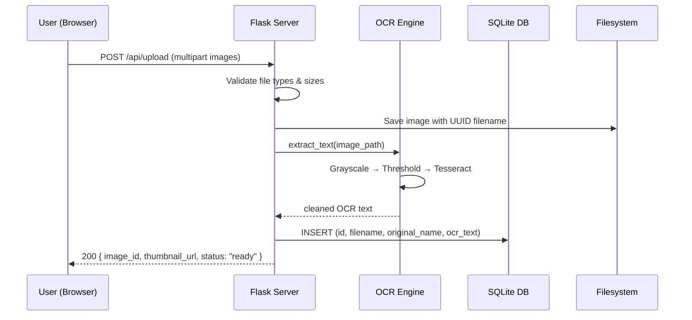
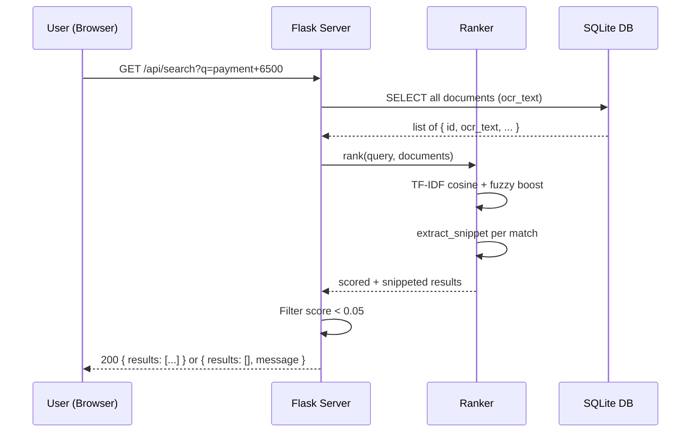

# Architecture — MVP: OCR-Based Document Search
## Google Photos Retrieval Research Project

---

## 1. System Overview

A lightweight, single-page web application that proves one thesis: **extracting
and indexing the actual text inside document-type images lets users find the
right document by searching for real content (names, amounts, dates) — something
Google Photos currently cannot do.**

The system follows a classic **three-tier** pattern kept deliberately minimal to
match the MVP scope:

```
┌─────────────────────────────────────────────────────────┐
│                    BROWSER (Client)                     │
│  ┌──────────┐  ┌──────────┐  ┌────────────────────────┐│
│  │  Upload   │  │  Search  │  │  Results + Snippet     ││
│  │  Zone     │  │  Bar     │  │  Cards + Full Preview  ││
│  └──────────┘  └──────────┘  └────────────────────────┘│
└────────────────────────┬────────────────────────────────┘
                         │ HTTP (REST JSON)
┌────────────────────────▼────────────────────────────────┐
│                  FLASK SERVER (Backend)                  │
│  ┌──────────┐  ┌──────────────┐  ┌────────────────────┐│
│  │  Upload   │  │  OCR Engine  │  │  Search / Ranking  ││
│  │  Handler  │  │  (Tesseract) │  │  Engine            ││
│  └──────────┘  └──────────────┘  └────────────────────┘│
└────────────────────────┬────────────────────────────────┘
                         │
┌────────────────────────▼────────────────────────────────┐
│                    DATA LAYER                           │
│  ┌──────────────────┐  ┌──────────────────────────────┐│
│  │  Image Files      │  │  OCR Text Index (SQLite)     ││
│  │  (filesystem)     │  │                              ││
│  └──────────────────┘  └──────────────────────────────┘│
└─────────────────────────────────────────────────────────┘
```

---

## 2. Tech Stack

| Layer       | Technology                | Rationale                                                                 |
|-------------|---------------------------|---------------------------------------------------------------------------|
| **Frontend**| HTML + Vanilla CSS + JS   | Single page, no framework overhead; maximum control over design           |
| **Backend** | Python 3.11 + Flask       | Consistent with existing discovery-engine demo; lightweight               |
| **OCR**     | Tesseract via `pytesseract` | Free, open-source, well-documented; sufficient accuracy for printed text |
| **Image I/O** | Pillow (`PIL`)          | Standard Python image handling; needed by pytesseract                     |
| **Search**  | TF-IDF (`scikit-learn`) + fuzzy (`rapidfuzz`) | Explainable ranking; handles typos and partial matches |
| **Data Store** | SQLite (single file)  | Zero-config, portable, survives Render restarts with persistent disk      |
| **Deployment** | Render (free tier)    | Same platform as existing demo; public shareable link                     |
| **Server**  | Gunicorn                  | Production WSGI server for Render                                         |

> **Why SQLite over plain JSON?** While a JSON file would work for 5–10
> images, SQLite gives us safe concurrent reads (if two users hit the demo
> simultaneously), atomic writes, and trivial full-text-search via FTS5 as a
> potential micro-optimisation — all at zero operational cost.

---

## 3. Directory Structure

```
GooglePhotos_MVP/
├── app.py                     # Flask application entry point
├── config.py                  # Configuration constants
├── requirements.txt           # Python dependencies
├── Procfile                   # Render deployment command
├── render.yaml                # Render service definition
│
├── ocr/
│   ├── __init__.py
│   └── engine.py              # Tesseract wrapper — extract text from image
│
├── search/
│   ├── __init__.py
│   └── ranker.py              # TF-IDF + fuzzy scoring logic
│
├── storage/
│   ├── __init__.py
│   └── db.py                  # SQLite CRUD for images + OCR text
│
├── static/
│   ├── css/
│   │   └── style.css          # All styles — design system, layout, animations
│   ├── js/
│   │   └── app.js             # Upload, search, result rendering, preview modal
│   └── uploads/               # Uploaded image files (gitignored in prod)
│
├── templates/
│   └── index.html             # Single-page shell
│
├── tests/
│   ├── test_ocr.py            # OCR extraction unit tests
│   ├── test_search.py         # Search ranking unit tests
│   └── test_api.py            # Endpoint integration tests
│
├── mock_data/                 # Pre-built test documents (committed to repo)
│   ├── mock_payment.png
│   ├── mock_aadhaar.png
│   ├── mock_receipt.png
│   ├── mock_medicine.png
│   ├── mock_marksheet.png
│   ├── mock_distractor_1.png
│   ├── mock_distractor_2.png
│   └── mock_distractor_3.png
│
├── PRD.md
├── ProblemStatement.md
└── architecture.md            # ← This file
```

---

## 4. Component Design

### 4.1 Frontend — Single-Page App (`index.html` + `app.js` + `style.css`)

The entire UI lives in one page with three visual zones:

```
┌──────────────────────────────────────────────────┐
│  HEADER: Title + tagline                         │
├──────────────────────────────────────────────────┤
│  UPLOAD ZONE                                     │
│  ┌────────────────────────────────────────────┐  │
│  │  Drag & drop area  /  "Browse" button      │  │
│  │  Thumbnail strip of uploaded images        │  │
│  └────────────────────────────────────────────┘  │
├──────────────────────────────────────────────────┤
│  SEARCH BAR                                      │
│  ┌────────────────────────────────────────────┐  │
│  │  🔍  [___search query___]   [Search]       │  │
│  └────────────────────────────────────────────┘  │
├──────────────────────────────────────────────────┤
│  RESULTS AREA                                    │
│  ┌──────────┐  ┌──────────┐  ┌──────────┐       │
│  │ Thumbnail│  │ Thumbnail│  │ Thumbnail│       │
│  │ ──────── │  │ ──────── │  │ ──────── │       │
│  │ Matching │  │ Matching │  │ Matching │       │
│  │ snippet  │  │ snippet  │  │ snippet  │       │
│  │ Score: 92│  │ Score: 78│  │ Score: 41│       │
│  └──────────┘  └──────────┘  └──────────┘       │
│                                                  │
│  — or —  "No results found" empty state          │
├──────────────────────────────────────────────────┤
│  FULL-IMAGE PREVIEW MODAL (click to open)        │
│  ┌────────────────────────────────────────────┐  │
│  │  Full-size image  +  full OCR text          │  │
│  └────────────────────────────────────────────┘  │
└──────────────────────────────────────────────────┘
```

**Key UI behaviours:**

| Behaviour | Detail |
|-----------|--------|
| Upload feedback | Show a progress spinner per image during OCR processing; replace with thumbnail + ✅ on completion |
| Search-as-you-type | Debounced (300 ms) fetch to `/api/search` on every keystroke ≥ 2 chars |
| Snippet highlighting | Matching query terms highlighted in **bold yellow** within the snippet text |
| No-results state | Explicit message: *"No documents matched your search."* — never show unrelated images (core thesis) |
| Full preview | Click thumbnail → modal overlay with full image + complete extracted OCR text side-by-side |

**Design aesthetic:** Dark-mode glassmorphism card layout, smooth fade-in
animations on results, Inter font via Google Fonts, vibrant accent gradient
(`#6C63FF` → `#00D2FF`).

### 4.2 Backend — Flask Application (`app.py`)

Thin routing layer. All business logic lives in the `ocr/`, `search/`, and
`storage/` modules.

**API Endpoints:**

```
POST /api/upload
  → Accept multipart/form-data (multiple images)
  → For each image:
      1. Validate type (png, jpg, jpeg, webp) and size (< 10 MB)
      2. Save to static/uploads/ with UUID filename
      3. Run OCR → extract text
      4. Store { image_id, filename, original_name, ocr_text, upload_ts }
         in SQLite
  → Return JSON: list of { image_id, original_name, thumbnail_url, status }

GET /api/search?q=<query>
  → Validate query (non-empty, ≤ 200 chars)
  → Fetch all OCR records from DB
  → Run ranker.rank(query, records) → scored list
  → Filter out score = 0 (no match at all)
  → Return JSON: ranked list of {
        image_id, thumbnail_url, score,
        snippet (≤ 150 chars around best match region),
        highlight_ranges
    }
  → If empty after filtering: return { results: [], message: "No results" }

GET /api/images/<image_id>
  → Return full image file (for preview modal)

GET /api/images/<image_id>/ocr
  → Return full OCR text (for preview modal)

DELETE /api/images/<image_id>
  → Remove image file + DB record

GET /api/library
  → Return all uploaded images (id, thumbnail_url, original_name)
  → Used to populate the upload-zone thumbnail strip
```

### 4.3 OCR Engine (`ocr/engine.py`)

**Pre-processing pipeline** (critical for receipt/screenshot accuracy):

```
Original Image
     │
     ▼
  Grayscale conversion (PIL.convert('L'))
     │
     ▼
  Resize if < 300 DPI equivalent (scale up 2×)
     │
     ▼
  Adaptive threshold (Pillow ImageFilter or OpenCV if needed)
     │
     ▼
  Tesseract OCR (--oem 3 --psm 6)
     │
     ▼
  Text cleanup (normalize whitespace, strip control chars)
     │
     ▼
  Cleaned OCR text string
```

**Module interface:**

```python
def extract_text(image_path: str) -> str:
    """
    Pipeline:
    1. Open with Pillow
    2. Convert to grayscale
    3. Apply adaptive thresholding (improves OCR on receipts/screenshots)
    4. Run pytesseract.image_to_string()
    5. Normalize whitespace, strip non-printable chars
    6. Return cleaned text
    """
```

> **Tesseract PSM choice:** `--psm 6` (assume a single uniform block of text)
> works best for most document images. If accuracy is poor on specific image
> types during testing, we can add a fallback that retries with `--psm 3`
> (fully automatic page segmentation).

### 4.4 Search & Ranking Engine (`search/ranker.py`)

Two-stage scoring to balance precision and recall:

```
Stage 1: TF-IDF Cosine Similarity
  ┌─────────────────────────────────────────┐
  │  Build TF-IDF vectors from all OCR texts│
  │  Compute cosine similarity(query, doc)  │
  │  → base_score (0.0 – 1.0)              │
  └──────────────────┬──────────────────────┘
                     │
Stage 2: Fuzzy Token Matching (boost)
  ┌──────────────────▼──────────────────────┐
  │  For each query token:                  │
  │    Find best fuzzy match in doc text    │
  │    (rapidfuzz.fuzz.partial_ratio)       │
  │  Average fuzzy score → fuzzy_boost      │
  │  (0.0 – 1.0, scaled to 0.0 – 0.3)     │
  └──────────────────┬──────────────────────┘
                     │
Final Score:
  score = (0.7 × base_score) + (0.3 × fuzzy_boost)

  If score < 0.05 → treat as no match (exclude from results)
```

**Snippet extraction:**

```python
def extract_snippet(ocr_text: str, query: str, max_len: int = 150) -> str:
    """
    1. Find the position of the best-matching query token in the OCR text
    2. Extract a window of ±75 chars around that position
    3. Return with "..." truncation if needed
    4. Include highlight_ranges (start, end) for each matched token
       within the snippet for frontend bolding
    """
```

> **Why TF-IDF + fuzzy, not just substring search?** Substring search would
> fail on OCR errors (e.g. "₹6500" OCR'd as "Rs 6500" or "6 500"). TF-IDF
> handles term importance, and fuzzy matching absorbs minor OCR noise. This
> combination stays explainable (a PRD requirement) while being robust.

### 4.5 Data Layer (`storage/db.py`)

**SQLite schema:**

```sql
CREATE TABLE IF NOT EXISTS documents (
    id          TEXT PRIMARY KEY,    -- UUID
    filename    TEXT NOT NULL,       -- UUID-based filename on disk
    original_name TEXT NOT NULL,     -- User's original filename
    ocr_text    TEXT NOT NULL,       -- Full extracted OCR text
    uploaded_at TIMESTAMP DEFAULT CURRENT_TIMESTAMP
);

-- Optional: FTS5 virtual table for faster full-text matching at scale
-- (not strictly needed for 5-10 docs, but trivial to add)
CREATE VIRTUAL TABLE IF NOT EXISTS documents_fts
USING fts5(ocr_text, content='documents', content_rowid='rowid');
```

**Module interface:**

```python
def init_db() -> None: ...               # Create tables if not exist
def insert_document(doc: dict) -> str: ...  # Insert, return id
def get_all_documents() -> list[dict]: ...  # All records (for search)
def get_document(doc_id: str) -> dict: ...  # Single record (for preview)
def delete_document(doc_id: str) -> None: ...
def get_document_count() -> int: ...      # For upload limit validation
```

---

## 5. Data Flow Diagrams

### 5.1 Upload Flow



### 5.2 Search Flow



---

## 6. Configuration (`config.py`)

```python
import os

class Config:
    # Paths
    UPLOAD_FOLDER = os.path.join('static', 'uploads')
    DATABASE_PATH = os.path.join('instance', 'documents.db')

    # Upload constraints
    MAX_FILE_SIZE_MB = 10
    MAX_LIBRARY_SIZE = 30         # Max total uploaded docs
    ALLOWED_EXTENSIONS = {'png', 'jpg', 'jpeg', 'webp'}

    # OCR
    TESSERACT_CMD = os.environ.get('TESSERACT_CMD', 'tesseract')
    TESSERACT_PSM = 6             # Page segmentation mode
    TESSERACT_OEM = 3             # OCR engine mode

    # Search
    MIN_SCORE_THRESHOLD = 0.05    # Below this → no match
    SNIPPET_MAX_LENGTH = 150      # Chars around best match
    TFIDF_WEIGHT = 0.7
    FUZZY_WEIGHT = 0.3

    # Server
    DEBUG = os.environ.get('FLASK_DEBUG', 'false').lower() == 'true'
    SECRET_KEY = os.environ.get('SECRET_KEY', 'dev-key-change-in-prod')
```

---

## 7. Error Handling Strategy

| Scenario | Handling | User-facing message |
|----------|----------|---------------------|
| Unsupported file type | Reject with 400 | *"Only PNG, JPG, and WebP images are supported."* |
| File too large (> 10 MB) | Reject with 413 | *"Image must be under 10 MB."* |
| OCR extracts empty text | Store with empty string; warn user | *"No text could be detected in this image."* (shown on thumbnail) |
| Tesseract not installed | Fail startup with clear log | N/A (deployment issue) |
| Search query empty | Return 400 | *"Please enter a search term."* |
| No search results | Return 200 with empty results | *"No documents matched your search."* |
| Library at max capacity | Reject upload with 400 | *"Library full (max 30 documents). Delete some to upload more."* |

> **Empty OCR is not an error to hide.** If Tesseract returns empty text for an
> image, the image should still be stored and visible in the library — but
> flagged with a warning icon so the user knows it won't appear in search
> results. This transparency is important for the research demo.

---

## 8. Deployment Architecture (Render)

```
┌─────────────────────────────────────────┐
│              Render Free Tier           │
│                                         │
│  ┌───────────────────────────────────┐  │
│  │  Web Service                      │  │
│  │  Build: pip install -r req.txt    │  │
│  │  Start: gunicorn app:app          │  │
│  │  Env: TESSERACT_CMD, SECRET_KEY   │  │
│  └───────────────────┬───────────────┘  │
│                      │                  │
│  ┌───────────────────▼───────────────┐  │
│  │  Persistent Disk (free 1 GB)      │  │
│  │  /data/uploads/  (images)         │  │
│  │  /data/instance/  (SQLite DB)     │  │
│  └───────────────────────────────────┘  │
│                                         │
│  Tesseract installed via apt             │
└─────────────────────────────────────────┘
```

**Render config (`render.yaml`):**

```yaml
services:
  - type: web
    name: ocr-document-search
    runtime: python
    buildCommand: |
      apt-get update && apt-get install -y tesseract-ocr
      pip install -r requirements.txt
    startCommand: gunicorn app:app --bind 0.0.0.0:$PORT --workers 2
    envVars:
      - key: TESSERACT_CMD
        value: /usr/bin/tesseract
      - key: SECRET_KEY
        generateValue: true
    disk:
      name: data
      mountPath: /data
      sizeGB: 1
```

**`Procfile` (fallback):**

```
web: gunicorn app:app --bind 0.0.0.0:$PORT --workers 2 --timeout 120
```

> **Timeout:** OCR on a single image typically takes 1–3 seconds. The 120s
> Gunicorn timeout accommodates batch uploads of 10 images processed
> sequentially. If this proves slow, we can add a simple background queue
> (but this is unlikely to be needed at MVP scale).

---

## 9. Dependencies (`requirements.txt`)

```
flask==3.1.*
gunicorn==23.*
pytesseract==0.3.*
Pillow==11.*
scikit-learn==1.6.*
rapidfuzz==3.*
```

**System dependency:** `tesseract-ocr` (installed via apt on Render).

---

## 10. Security Considerations

| Concern | Mitigation |
|---------|------------|
| Uploaded file safety | Validate MIME type + extension; rename to UUID; never execute uploaded content |
| Path traversal | UUID filenames only; no user-supplied paths reach filesystem |
| XSS in OCR text | All OCR text rendered via `textContent` (JS), not `innerHTML` |
| Denial of service | File size cap (10 MB), library cap (30 docs), rate limiting via Render |
| Data privacy | No real PII in test data (mock documents only per PRD); no analytics/tracking |
| No auth needed | Single-session demo — no login, no persistent user identity (per PRD non-goals) |

---

## 11. Testing Strategy

### 11.1 Unit Tests

| Module | Tests |
|--------|-------|
| `ocr/engine.py` | Extracts known text from a test image; handles empty image; handles non-image file gracefully |
| `search/ranker.py` | Exact match scores highest; partial match scores above zero; completely unrelated query scores zero; fuzzy match catches OCR typos; snippet extraction returns correct window |
| `storage/db.py` | Insert → retrieve round-trip; delete removes record; duplicate ID raises error |

### 11.2 Integration Tests

| Test | Description |
|------|-------------|
| Upload flow | POST image → verify DB record created, OCR text non-empty, file on disk |
| Search flow | Upload 3 images with known text → search for term in only one → verify it ranks #1 |
| No-results | Upload images → search for completely unrelated term → verify empty results with message |
| Delete flow | Upload → delete → verify file and record removed |

### 11.3 Manual User Acceptance (3-User Test)

Per the PRD, the core validation is a **3-user test** with realistic tasks:

1. Pre-load 8 mock documents (5 distinct + 3 distractors)
2. Give each user 3 retrieval tasks:
   - *"Find the payment screenshot where the amount was ₹6500"*
   - *"Find the ID card belonging to Samrat Mehta"*
   - *"Find the invoice from March"*
3. **Success:** User finds the correct document in ≤ 2 attempts using a
   natural search term, faster than their reported Google Photos experience

---

## 12. Performance Budgets

| Metric | Target | Rationale |
|--------|--------|-----------|
| OCR per image | < 3 seconds | Tesseract on a standard document image |
| Search response | < 200 ms | TF-IDF on ≤ 30 documents is trivial |
| Page load (LCP) | < 2 seconds | Minimal static assets, no framework bloat |
| Total upload (10 images) | < 30 seconds | Sequential OCR; acceptable for demo |

---

## 13. Future Considerations (V2 — explicitly out of scope)

These are documented here for continuity but are **not built in the MVP:**

| Feature | Notes |
|---------|-------|
| Query-suggestion UI | Auto-suggest search terms based on extracted text (validated in research, deferred) |
| Structured field extraction | Detect document type → extract name/amount/date into structured fields |
| Semantic search | Replace TF-IDF with embedding-based search for natural-language queries |
| Multi-language OCR | Add Tesseract language packs for Hindi/regional scripts |
| Cloud OCR fallback | Use Google Vision API if Tesseract accuracy is insufficient |
| Real Google Photos integration | Chrome extension or API integration (requires Google API access) |

---

## 14. Decision Log

| # | Decision | Rationale | Date |
|---|----------|-----------|------|
| 1 | Flask over FastAPI | Consistency with existing discovery-engine demo; simpler for MVP | 2026-10-01 |
| 2 | SQLite over JSON file | Concurrent safety, atomic writes, FTS5 option, zero-config | 2026-10-01 |
| 3 | TF-IDF + fuzzy over pure substring | Handles OCR noise, provides ranking, stays explainable | 2026-10-01 |
| 4 | Tesseract over cloud OCR | Free, no API key needed, sufficient for printed text | 2026-10-01 |
| 5 | Single-page HTML over React/Vue | No build step, minimal complexity, fast to iterate | 2026-10-01 |
| 6 | Persistent disk over ephemeral | Uploaded test data survives Render restarts | 2026-10-01 |
| 7 | No authentication | MVP is a single-session demo, not a multi-user product | 2026-10-01 |
