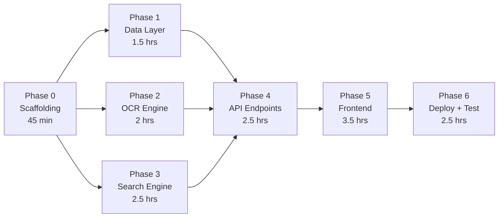

# Implementation Plan — MVP: OCR-Based Document Search
## Google Photos Retrieval Research Project

---

## How to Read This Plan

- **6 phases**, ordered by dependency (each phase unlocks the next)
- Each phase contains **numbered tasks** — work through them sequentially within a phase
- Every task lists the **file(s) to create/edit**, **what to do**, and a **done-when** checkpoint
- Estimated times assume a single developer working in focused blocks
- **Total estimate: ~12–15 hours of implementation** (not counting the 3-user acceptance test)

---

## Phase 0 — Project Scaffolding & Environment
> **Goal:** A running Flask dev server that returns "Hello World" — proving
> the toolchain works before writing any business logic.
>
> **Estimated time: 45 min**

### Task 0.1 — Initialize project structure

**Files to create:**
```
GooglePhotos_MVP/
├── app.py
├── config.py
├── requirements.txt
├── .gitignore
├── ocr/
│   └── __init__.py
├── search/
│   └── __init__.py
├── storage/
│   └── __init__.py
├── static/
│   ├── css/
│   ├── js/
│   └── uploads/        ← gitignored
├── templates/
├── tests/
└── mock_data/
```

**What to do:**
1. Create all directories and empty `__init__.py` files
2. Add `static/uploads/` to `.gitignore`
3. Create `.gitignore` with standard Python entries + `instance/`, `static/uploads/`, `*.db`

**Done when:** Directory tree matches the architecture spec.

---

### Task 0.2 — Write `requirements.txt`

**File:** `requirements.txt`

```
flask==3.1.*
gunicorn==23.*
pytesseract==0.3.*
Pillow==11.*
scikit-learn==1.6.*
rapidfuzz==3.*
```

**Done when:** `pip install -r requirements.txt` completes without errors.

---

### Task 0.3 — Write `config.py`

**File:** `config.py`

Implement the `Config` class exactly as specified in architecture §6, with all
constants: `UPLOAD_FOLDER`, `DATABASE_PATH`, `MAX_FILE_SIZE_MB`,
`MAX_LIBRARY_SIZE`, `ALLOWED_EXTENSIONS`, Tesseract settings, search thresholds,
and server settings.

**Done when:** `from config import Config` succeeds; `Config.UPLOAD_FOLDER` returns `'static/uploads'`.

---

### Task 0.4 — Minimal Flask app

**File:** `app.py`

```python
# Minimal shell:
# - Import Flask, Config
# - Create app with config
# - Ensure upload folder exists on startup
# - Single route GET / → render templates/index.html
# - if __name__ == '__main__': app.run(debug=True)
```

**File:** `templates/index.html`
- Bare HTML5 shell with `<h1>OCR Document Search</h1>` placeholder

**Done when:** `python app.py` → browser at `http://localhost:5000` shows the heading.

---

### Task 0.5 — Install Tesseract locally

**What to do:**
- **Windows:** Download installer from [UB Mannheim Tesseract](https://github.com/UB-Mannheim/tesseract/wiki), add to PATH
- **macOS:** `brew install tesseract`
- **Linux:** `sudo apt-get install tesseract-ocr`

**Done when:** `tesseract --version` prints version info in terminal.

---

## Phase 1 — Data Layer (SQLite)
> **Goal:** A working database module that can store and retrieve document
> records — the foundation everything else writes to and reads from.
>
> **Depends on:** Phase 0
>
> **Estimated time: 1.5 hours**

### Task 1.1 — Implement `storage/db.py`

**File:** `storage/db.py`

Implement all functions from architecture §4.5:

| Function | Behaviour |
|----------|-----------|
| `init_db()` | Create `documents` table if not exists (schema from architecture §4.5). Create `instance/` dir if needed. |
| `insert_document(doc)` | Accept dict `{id, filename, original_name, ocr_text}`. INSERT into table. Return `id`. |
| `get_all_documents()` | SELECT all rows. Return `list[dict]`. |
| `get_document(doc_id)` | SELECT by id. Return `dict` or `None`. |
| `delete_document(doc_id)` | DELETE by id. No-op if not found. |
| `get_document_count()` | SELECT COUNT(*). Return `int`. |

**Implementation notes:**
- Use `sqlite3` from stdlib (no ORM)
- Use `sqlite3.Row` factory for dict-like access
- Database path from `Config.DATABASE_PATH`
- All functions open/close their own connection (safe for Flask request cycle)
- Parameterized queries everywhere (no f-strings in SQL)

**Done when:** Can run in Python REPL:
```python
from storage.db import init_db, insert_document, get_all_documents
init_db()
insert_document({'id': 'test-1', 'filename': 'f.png', 'original_name': 'my.png', 'ocr_text': 'hello world'})
docs = get_all_documents()
assert len(docs) == 1 and docs[0]['ocr_text'] == 'hello world'
```

---

### Task 1.2 — Wire `init_db()` into Flask startup

**File:** `app.py` (edit)

Add `init_db()` call during app initialization (before first request or at
module level), so the database is ready when the server starts.

**Done when:** Starting the Flask app creates `instance/documents.db` if it doesn't exist.

---

### Task 1.3 — Unit tests for storage

**File:** `tests/test_storage.py`

| Test | Asserts |
|------|---------|
| `test_insert_and_retrieve` | Insert → get_all returns 1 doc with correct fields |
| `test_get_by_id` | Insert → get_document(id) returns correct doc |
| `test_get_missing_id` | get_document('nonexistent') returns None |
| `test_delete` | Insert → delete → get_all returns 0 |
| `test_count` | Insert 3 → get_document_count() == 3 |

Use a temporary database (e.g., `tmp/test.db` or in-memory `:memory:`) per test.

**Done when:** `python -m pytest tests/test_storage.py` → all pass.

---

## Phase 2 — OCR Engine
> **Goal:** Given an image file path, return cleaned extracted text.
> This is the core mechanism the entire MVP is built around.
>
> **Depends on:** Phase 0 (Tesseract installed)
>
> **Estimated time: 2 hours**

### Task 2.1 — Implement `ocr/engine.py`

**File:** `ocr/engine.py`

Implement `extract_text(image_path: str) -> str` with the full pre-processing
pipeline from architecture §4.3:

```python
def extract_text(image_path: str) -> str:
    # 1. Open image with Pillow
    # 2. Convert to grayscale  →  img.convert('L')
    # 3. Resize if small       →  if width < 1000: resize 2×
    # 4. Sharpen               →  ImageFilter.SHARPEN
    # 5. Run Tesseract         →  pytesseract.image_to_string(img, config='--oem 3 --psm 6')
    # 6. Clean text            →  collapse whitespace, strip control chars
    # 7. Return cleaned string (may be empty if no text detected)
```

**Edge cases to handle:**
- Image file doesn't exist → raise `FileNotFoundError`
- Corrupted/unreadable image → catch `PIL.UnidentifiedImageError`, return `''`
- Tesseract returns only whitespace → return `''`

**Done when:** Call `extract_text('path/to/a/receipt.png')` and get recognizable text back.

---

### Task 2.2 — Create test images for OCR validation

**File:** `mock_data/` — create 2–3 simple test images

For unit testing, create minimal images with known text:
1. Use Python + Pillow to **generate** a simple image with known text rendered on it
   (e.g., white background, black text "Payment Amount Rs 6500 Date March 2026")
2. Save as `mock_data/test_payment.png`
3. Repeat with a different text for a second test image

This ensures tests are deterministic — no dependency on external test files.

**File:** `tests/generate_test_images.py` — script to create these

**Done when:** `mock_data/test_payment.png` exists and has readable text visible in it.

---

### Task 2.3 — Unit tests for OCR engine

**File:** `tests/test_ocr.py`

| Test | Asserts |
|------|---------|
| `test_extract_known_text` | `extract_text(test_payment.png)` contains "6500" |
| `test_extract_returns_string` | Result is `str` type |
| `test_missing_file` | Raises `FileNotFoundError` |
| `test_non_image_file` | Returns empty string (not crash) |
| `test_whitespace_cleanup` | No leading/trailing whitespace, no double-spaces |

**Done when:** `python -m pytest tests/test_ocr.py` → all pass.

---

## Phase 3 — Search & Ranking Engine
> **Goal:** Given a query and a list of OCR texts, return ranked results with
> snippets. This is what makes the search *work* — the intellectual core.
>
> **Depends on:** Phase 0
>
> **Estimated time: 2.5 hours**

### Task 3.1 — Implement `search/ranker.py`

**File:** `search/ranker.py`

Implement the two-stage ranking from architecture §4.4:

```python
def rank(query: str, documents: list[dict]) -> list[dict]:
    """
    Input:
        query: user's search string (e.g., "payment 6500")
        documents: list of dicts with at least {id, ocr_text}

    Output:
        list of dicts sorted by score descending:
        {id, score, snippet, highlight_ranges}

    Algorithm:
        1. Build TF-IDF matrix from all documents' ocr_text
        2. Transform query into same TF-IDF space
        3. Compute cosine similarity → base_score per doc
        4. For each doc, compute fuzzy token match → fuzzy_boost
        5. final_score = (0.7 × base_score) + (0.3 × fuzzy_boost)
        6. Filter out score < MIN_SCORE_THRESHOLD
        7. Extract snippet for each surviving result
        8. Sort descending by score, return
    """
```

**Sub-functions to implement:**

| Function | Purpose |
|----------|---------|
| `_tfidf_scores(query, doc_texts)` | Returns list of cosine similarities |
| `_fuzzy_score(query, doc_text)` | Returns average fuzzy ratio across query tokens |
| `extract_snippet(ocr_text, query, max_len=150)` | Returns `{text, highlight_ranges}` |

**Important:** Handle edge case where `documents` is empty → return `[]` immediately
(don't let TF-IDF vectorizer crash on empty corpus).

**Done when:** Can call `rank("payment 6500", [{"id":"1","ocr_text":"Payment received Rs 6500"}, {"id":"2","ocr_text":"Medicine Paracetamol 500mg"}])` and doc 1 scores higher than doc 2.

---

### Task 3.2 — Implement snippet extraction

**File:** `search/ranker.py` (same file, separate function)

```python
def extract_snippet(ocr_text: str, query: str, max_len: int = 150) -> dict:
    """
    Returns: {
        "text": "...received Rs 6500 on March...",
        "highlight_ranges": [[14, 18]]  # character ranges for "6500"
    }

    Algorithm:
    1. Tokenize query
    2. Find best fuzzy match position for the most relevant query token
    3. Extract ±(max_len//2) chars around that position
    4. Add "..." prefix/suffix if truncated
    5. Compute highlight ranges relative to the snippet start
    """
```

**Done when:** `extract_snippet("Payment received Rs 6500 on 15 March 2026 for services", "6500")` returns a snippet containing "6500" with correct highlight range.

---

### Task 3.3 — Unit tests for search/ranking

**File:** `tests/test_search.py`

| Test | Asserts |
|------|---------|
| `test_exact_match_ranks_first` | Doc containing exact query term scores highest |
| `test_partial_match_scores_above_zero` | Doc with partial overlap has score > 0 |
| `test_no_match_scores_zero` | Completely unrelated doc filtered out |
| `test_fuzzy_handles_ocr_noise` | "Rs 6500" matches query "₹6500" (fuzzy boost) |
| `test_empty_corpus` | Empty doc list returns empty results |
| `test_snippet_contains_match` | Snippet text includes the matched term |
| `test_snippet_highlight_ranges` | Ranges correctly point to matched term positions |
| `test_ranking_order` | Multiple docs returned in descending score order |

**Done when:** `python -m pytest tests/test_search.py` → all pass.

---

## Phase 4 — Backend API Endpoints
> **Goal:** All 6 REST endpoints working and testable with `curl` or Postman.
> This wires together the storage, OCR, and search modules.
>
> **Depends on:** Phases 1, 2, 3
>
> **Estimated time: 2.5 hours**

### Task 4.1 — `POST /api/upload`

**File:** `app.py` (add route)

**Behaviour:**
1. Accept `multipart/form-data` with key `files` (multiple files)
2. For each file:
   - Validate extension against `Config.ALLOWED_EXTENSIONS`
   - Validate size against `Config.MAX_FILE_SIZE_MB`
   - Check `get_document_count() < Config.MAX_LIBRARY_SIZE`
   - Generate UUID, save as `{uuid}.{ext}` in `Config.UPLOAD_FOLDER`
   - Call `ocr.engine.extract_text(saved_path)`
   - Call `storage.db.insert_document({id, filename, original_name, ocr_text})`
3. Return JSON:
   ```json
   {
     "uploaded": [
       {
         "image_id": "uuid-here",
         "original_name": "payment.png",
         "thumbnail_url": "/static/uploads/uuid-here.png",
         "ocr_preview": "Payment received Rs 6500...",
         "status": "ready"
       }
     ],
     "errors": []
   }
   ```
4. If any individual file fails validation, include it in `errors` but continue
   processing remaining files

**Done when:** `curl -X POST -F "files=@test.png" http://localhost:5000/api/upload` returns JSON with image_id, and the DB contains the OCR text.

---

### Task 4.2 — `GET /api/search?q=<query>`

**File:** `app.py` (add route)

**Behaviour:**
1. Read `q` from query params
2. Validate: non-empty, ≤ 200 chars → else 400
3. Fetch all documents via `storage.db.get_all_documents()`
4. Call `search.ranker.rank(query, documents)`
5. For each result, attach `thumbnail_url` from the document's filename
6. Return JSON:
   ```json
   {
     "query": "payment 6500",
     "results": [
       {
         "image_id": "uuid",
         "thumbnail_url": "/static/uploads/uuid.png",
         "score": 0.87,
         "snippet": "...received Rs 6500 on March...",
         "highlight_ranges": [[14, 18]]
       }
     ]
   }
   ```
7. If no results after filtering: `{"query": "...", "results": [], "message": "No documents matched your search."}`

**Done when:** Upload 2 images with different text → `curl "http://localhost:5000/api/search?q=6500"` → returns only the relevant one.

---

### Task 4.3 — `GET /api/library`

**File:** `app.py` (add route)

Return all uploaded documents (id, thumbnail_url, original_name, has_ocr_text boolean).

**Done when:** After uploading 3 images, `/api/library` returns all 3 with correct metadata.

---

### Task 4.4 — `GET /api/images/<image_id>` and `GET /api/images/<image_id>/ocr`

**File:** `app.py` (add routes)

- `/api/images/<id>` → `send_file()` for the image (or 404)
- `/api/images/<id>/ocr` → JSON `{"ocr_text": "full text here"}` (or 404)

**Done when:** Both endpoints return correct data for a valid id and 404 for invalid.

---

### Task 4.5 — `DELETE /api/images/<image_id>`

**File:** `app.py` (add route)

1. Look up document in DB
2. Delete file from disk
3. Delete record from DB
4. Return `{"deleted": true}`
5. If not found → 404

**Done when:** Upload → delete → `/api/library` no longer lists it, file gone from disk.

---

### Task 4.6 — Integration tests for all endpoints

**File:** `tests/test_api.py`

Use Flask's test client (`app.test_client()`):

| Test | Asserts |
|------|---------|
| `test_upload_valid_image` | 200, response has image_id, DB record exists |
| `test_upload_invalid_type` | 400, `.txt` file rejected |
| `test_upload_too_large` | 413 (simulate with config override) |
| `test_search_finds_match` | Upload known image → search → correct result first |
| `test_search_no_match` | Search nonsense → empty results with message |
| `test_search_empty_query` | 400 error |
| `test_library_lists_all` | Upload 2 → library returns 2 |
| `test_get_image_valid` | 200, returns image bytes |
| `test_get_image_invalid` | 404 |
| `test_get_ocr_text` | Returns correct text |
| `test_delete_removes` | Upload → delete → library returns 0 |

**Done when:** `python -m pytest tests/test_api.py` → all pass.

---

## Phase 5 — Frontend
> **Goal:** A polished, visually impressive single-page UI that connects to
> all backend endpoints. This is what users and evaluators will see.
>
> **Depends on:** Phase 4
>
> **Estimated time: 3.5 hours**

### Task 5.1 — HTML structure (`templates/index.html`)

**File:** `templates/index.html`

Build the full page shell with semantic sections matching architecture §4.1:

```html
<!-- Sections (IDs for JS targeting): -->
<header id="app-header">            <!-- Title + tagline -->
<section id="upload-zone">          <!-- Drag-drop + browse + thumbnail strip -->
<section id="search-section">       <!-- Search input + button -->
<section id="results-area">         <!-- Result cards or empty state -->
<div id="preview-modal">            <!-- Full image + OCR overlay -->
```

**Include:**
- Google Fonts link (Inter)
- `<link>` to `static/css/style.css`
- `<script>` to `static/js/app.js` (deferred)
- SEO: proper `<title>`, `<meta description>`, `<h1>`
- All interactive elements have unique IDs

**Done when:** Page loads in browser with all sections visible (unstyled but structured).

---

### Task 5.2 — Design system & styles (`static/css/style.css`)

**File:** `static/css/style.css`

Implement the full visual design:

**Design tokens:**
```css
:root {
    --bg-primary: #0f0f1a;        /* Deep dark background */
    --bg-card: rgba(255,255,255,0.05);  /* Glassmorphism cards */
    --accent-start: #6C63FF;      /* Gradient start */
    --accent-end: #00D2FF;        /* Gradient end */
    --text-primary: #f0f0f5;
    --text-secondary: #9898a6;
    --highlight: #FFD60A;         /* Snippet match highlight */
    --success: #4ADE80;
    --warning: #FBBF24;
    --error: #F87171;
    --radius: 16px;
    --blur: 20px;
}
```

**Key styles to implement:**

| Element | Style |
|---------|-------|
| Body | Dark background, Inter font, smooth scroll |
| Header | Large gradient text title, subtle tagline |
| Upload zone | Dashed border, drag-hover glow, glassmorphism background |
| Thumbnail strip | Horizontal scroll, rounded corners, subtle shadow |
| Search bar | Full-width, rounded, icon inside, glassmorphism |
| Result cards | Glass card with backdrop-blur, image thumbnail, snippet text, score badge |
| Snippet highlight | `<mark>` with yellow background |
| No-results state | Centered illustration/icon + message |
| Preview modal | Full-screen overlay, frosted glass backdrop, side-by-side layout |
| Animations | `@keyframes fadeInUp` for result cards, hover scale on cards |
| Responsive | Stack cards single-column on mobile (< 768px) |

**Done when:** Page looks visually polished in browser — dark mode, glass cards, gradient accents, Inter font.

---

### Task 5.3 — Upload functionality (`static/js/app.js` — Part 1)

**File:** `static/js/app.js`

Implement upload logic:

```javascript
// 1. Drag & drop handling
//    - dragover/dragenter → add visual "drop here" highlight
//    - drop → extract files, call uploadFiles()
//
// 2. "Browse" button → hidden <input type="file" multiple>
//
// 3. uploadFiles(fileList)
//    - Build FormData, append all files
//    - Show spinner per file in thumbnail strip
//    - POST to /api/upload
//    - On success: replace spinners with thumbnails + ✅
//    - On error per file: show ❌ with error message
//
// 4. Thumbnail strip
//    - Render each uploaded image as a small card
//    - Show OCR warning icon if ocr_preview is empty
```

**Done when:** Can drag images onto the page → see spinners → thumbnails appear with checkmarks.

---

### Task 5.4 — Search functionality (`static/js/app.js` — Part 2)

**File:** `static/js/app.js` (append)

Implement search logic:

```javascript
// 1. Search input event listener
//    - Debounce 300ms
//    - Only fire if query.length >= 2
//    - Call performSearch(query)
//
// 2. performSearch(query)
//    - GET /api/search?q=encodeURIComponent(query)
//    - If results.length > 0: render result cards
//    - If results.length === 0: show "No documents matched" state
//
// 3. renderResults(results)
//    - Clear results area
//    - For each result: create card with:
//      · Thumbnail image (from thumbnail_url)
//      · Snippet text with highlighted matches
//      · Score badge
//      · Click handler → openPreview(image_id)
//    - Animate cards in with staggered fadeInUp
//
// 4. Snippet highlighting
//    - Use highlight_ranges to wrap matched chars in <mark>
//    - Use textContent for non-highlighted parts (XSS safe)
//    - Use createElement('mark') for highlighted parts
```

**Done when:** Type in search bar → results appear with highlighted snippets, ranked by score. Unmatched query shows empty state.

---

### Task 5.5 — Preview modal (`static/js/app.js` — Part 3)

**File:** `static/js/app.js` (append)

```javascript
// 1. openPreview(imageId)
//    - Fetch /api/images/<id> for full image
//    - Fetch /api/images/<id>/ocr for full text
//    - Show modal with:
//      · Left: full-size image
//      · Right: scrollable OCR text
//    - Backdrop blur, click-outside-to-close, Escape key to close
//
// 2. closePreview()
//    - Hide modal, remove backdrop
```

**Done when:** Click a result card → modal shows full image + OCR text. Escape closes it.

---

### Task 5.6 — Load library on page load

**File:** `static/js/app.js` (append)

```javascript
// On DOMContentLoaded:
// 1. GET /api/library
// 2. Render existing thumbnails in the upload zone's thumbnail strip
// 3. Show upload zone prominently if library is empty
```

**Done when:** Refresh page → previously uploaded images still visible in thumbnail strip.

---

### Task 5.7 — Delete functionality

**File:** `static/js/app.js` (append)

- Add a small `×` delete button on each thumbnail in the strip
- On click: confirm → `DELETE /api/images/<id>` → remove thumbnail from strip
- If search results are showing, refresh the search

**Done when:** Can delete an image from the thumbnail strip; it disappears from library and search results.

---

### Task 5.8 — Frontend polish pass

**Files:** `style.css` + `app.js` (refinements)

Checklist:
- [ ] All animations smooth (no jank)
- [ ] Loading states visible for upload and search
- [ ] Error messages styled (toast or inline, not `alert()`)
- [ ] Responsive layout tested at 375px, 768px, 1280px
- [ ] Empty state has visual treatment (icon + text), not just text
- [ ] Score badge shows as percentage (e.g., "92% match")
- [ ] Keyboard: Enter triggers search, Escape closes modal
- [ ] Tab order is logical (upload → search → results)

**Done when:** Using the app feels smooth and visually premium on both mobile and desktop viewport sizes.

---

## Phase 6 — Mock Data, Deployment & Acceptance Testing
> **Goal:** Deploy a working public demo with pre-loaded test data, then
> validate with 3 real users — the final deliverable.
>
> **Depends on:** Phase 5
>
> **Estimated time: 2.5 hours (excluding user testing time)**

### Task 6.1 — Create mock document images

**File:** `mock_data/` — 8 images

Create realistic but safe-to-share mock documents using Pillow or a design tool:

| # | File | Content | Purpose |
|---|------|---------|---------|
| 1 | `mock_payment.png` | "Payment Receipt — Amount: ₹6,500 — To: Samrat Mehta — Date: 15 March 2026 — Ref: TXN9847321" | Primary test target |
| 2 | `mock_aadhaar.png` | "Aadhaar Card — Name: Samrat Mehta — DOB: 12/05/1995 — No: XXXX XXXX 4532" | Primary test target |
| 3 | `mock_receipt.png` | "Invoice #INV-2026-0312 — March 2026 — Grocery Mart — Total: ₹2,340" | Primary test target |
| 4 | `mock_medicine.png` | "Prescription — Dr. Anita Sharma — Patient: Ramesh Kumar — Paracetamol 500mg — Amoxicillin 250mg" | Primary test target |
| 5 | `mock_marksheet.png` | "Semester Mark Sheet — University of Delhi — Student: Priya Patel — Roll No: 2024/CS/0156 — CGPA: 8.7" | Primary test target |
| 6 | `mock_distractor_1.png` | "Payment Receipt — Amount: ₹1,500 — To: Vikram Singh — Date: 22 Jan 2026" | Distractor (different payment) |
| 7 | `mock_distractor_2.png` | "ID Card — Name: Meera Devi — Employee ID: EMP-4421" | Distractor (different ID card) |
| 8 | `mock_distractor_3.png` | "Invoice #INV-2026-0187 — January 2026 — Electronics Hub — Total: ₹12,899" | Distractor (different invoice) |

**Design notes:**
- Make them look like realistic document photos (slight tilt, background visible)
- Use a script (`tests/generate_mock_data.py`) to create them programmatically with Pillow
- Alternatively, design in Canva/Figma → export as PNG

**Done when:** All 8 images exist in `mock_data/`, each with distinct and clearly readable text.

---

### Task 6.2 — Add mock data pre-load script

**File:** `load_mock_data.py`

```python
"""
Standalone script to upload all mock_data/ images into the app's database.
Run once after deployment to pre-populate the demo.

Usage: python load_mock_data.py
"""
# 1. Import storage.db and ocr.engine
# 2. init_db()
# 3. For each image in mock_data/:
#    - Copy to static/uploads/ with UUID
#    - Run OCR
#    - Insert into DB
# 4. Print summary: "Loaded X documents"
```

**Done when:** `python load_mock_data.py` → `/api/library` returns 8 documents.

---

### Task 6.3 — Deployment config files

**Files:**

1. **`render.yaml`** — Render service definition (from architecture §8)
2. **`Procfile`** — `web: gunicorn app:app --bind 0.0.0.0:$PORT --workers 2 --timeout 120`
3. **`Dockerfile`** (if Render native buildpack doesn't support apt installs):
   ```dockerfile
   FROM python:3.11-slim
   RUN apt-get update && apt-get install -y tesseract-ocr && rm -rf /var/lib/apt/lists/*
   WORKDIR /app
   COPY requirements.txt .
   RUN pip install --no-cache-dir -r requirements.txt
   COPY . .
   CMD gunicorn app:app --bind 0.0.0.0:$PORT --workers 2 --timeout 120
   ```

**Done when:** All deployment files exist and are syntactically valid.

---

### Task 6.4 — Deploy to Render

**Steps:**
1. Push code to GitHub repository
2. Connect Render to the GitHub repo
3. Configure environment variables (`TESSERACT_CMD`, `SECRET_KEY`)
4. Attach persistent disk (1 GB at `/data`)
5. Update `Config` to use `/data/uploads` and `/data/instance/` when on Render
   (detect via `RENDER=true` env var)
6. Deploy → wait for build to succeed
7. Run `load_mock_data.py` against the deployed instance (or via a one-off
   management endpoint `/api/admin/load-mock-data` protected by a secret)

**Done when:** Public URL (e.g., `https://ocr-document-search.onrender.com`) shows the app with 8 pre-loaded documents.

---

### Task 6.5 — Smoke test the deployed app

**Checklist:**
- [ ] Page loads under 2 seconds
- [ ] All 8 mock documents visible in thumbnail strip
- [ ] Search "6500" → mock_payment appears first
- [ ] Search "Samrat" → mock_aadhaar and mock_payment appear (both contain the name)
- [ ] Search "invoice March" → mock_receipt appears first
- [ ] Search "xyznonexistent" → "No documents matched" message
- [ ] Click result → preview modal shows full image + OCR text
- [ ] Upload a new image → OCR runs → appears in library
- [ ] Delete an image → disappears from library
- [ ] Test on mobile viewport (phone browser or dev tools)

**Done when:** All checklist items pass on the live deployed URL.

---

### Task 6.6 — 3-user acceptance test

**Protocol:**

1. **Recruit 3 test users** (ideally from the original interview pool, or
   people who use Google Photos for document storage)

2. **Setup per user:**
   - Share the Render URL
   - Brief them: *"This is a small app with 8 document images already loaded.
     I'll give you 3 search tasks. Try to find each document using the search
     bar."*

3. **Tasks:**

   | # | Task prompt | Target document | Success criteria |
   |---|-------------|-----------------|------------------|
   | 1 | "Find the payment screenshot where the amount was ₹6500" | `mock_payment.png` | Found in ≤ 2 search attempts |
   | 2 | "Find the Aadhaar card belonging to Samrat Mehta" | `mock_aadhaar.png` | Found in ≤ 2 search attempts |
   | 3 | "Find the invoice from March" | `mock_receipt.png` | Found in ≤ 2 search attempts |

4. **Observe and record:**
   - What search terms they actually typed
   - How many attempts before finding the right document
   - Any confusion or frustration
   - Verbal comparison to their Google Photos experience

5. **Success threshold:**
   - Each user should complete ≥ 2 of 3 tasks successfully
   - Overall: ≥ 7 of 9 total tasks across 3 users

**Done when:** Test results documented, success threshold met, findings compiled for the research report.

---

## Summary: Phase Dependencies



> **Phases 1, 2, and 3 can run in parallel** — they have no dependencies on
> each other (only on Phase 0). This is the fastest path if multiple
> contributors are available.

---

## Quick Reference: All Files Created

| Phase | Files |
|-------|-------|
| 0 | `app.py`, `config.py`, `requirements.txt`, `.gitignore`, `templates/index.html`, package dirs |
| 1 | `storage/db.py`, `tests/test_storage.py` |
| 2 | `ocr/engine.py`, `tests/test_ocr.py`, `tests/generate_test_images.py` |
| 3 | `search/ranker.py`, `tests/test_search.py` |
| 4 | `app.py` (6 routes added), `tests/test_api.py` |
| 5 | `templates/index.html` (full), `static/css/style.css`, `static/js/app.js` |
| 6 | 8 mock images, `load_mock_data.py`, `render.yaml`, `Procfile`, `Dockerfile` |
